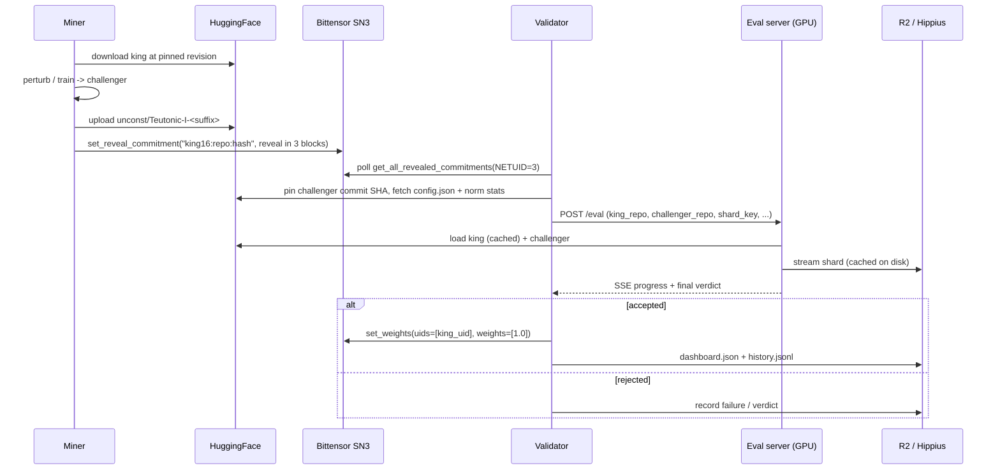
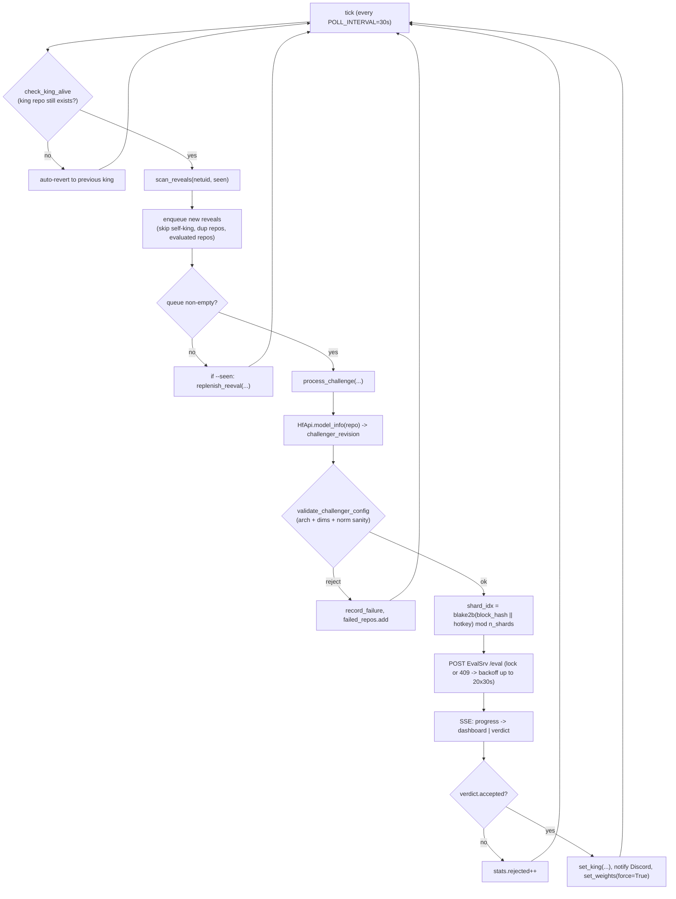

# Teutonic — Design

A reference document for another AI / collaborator. It explains how the Teutonic
king-of-the-hill incentive works end-to-end so we can reason about scaling the
economics to train larger models. The mechanism is intentionally minimal: one
global king, one paired statistical test, winner takes 100% of subnet emissions
until dethroned.

---

## 1. TL;DR

Teutonic is Bittensor subnet 3 ("holy pretraining incentives"). At any moment a
single HuggingFace checkpoint is the **king**. Anyone can submit a **challenger**
checkpoint via an on-chain commit-reveal. A validator runs a paired
cross-entropy test on a public token shard; if the challenger's expected
per-token NLL is statistically lower than the king's by at least `delta` nats,
the validator dethrones the king and assigns 100% of subnet weight to the
challenger's hotkey. Subnet 3 alpha emissions then flow entirely to the new
king until someone dethrones them in turn.

The economic primitives are:

- **Cost to play** — Bittensor SN3 registration burn + GPU compute to train a
  real challenger + HuggingFace bandwidth/storage.
- **Reward** — full SN3 alpha emission stream while you reign.
- **Acceptance rule** — paired bootstrap LCB on per-token log-loss difference,
  one-sided at `alpha=0.001`, with a fixed effect floor `delta=0.01`.

---

## 2. System actors and data flow



---

## 3. Economic primitives

**Identity = hotkey.** Mining and reward routing are tied to a Bittensor SS58
hotkey registered on subnet 3.

**Reward.** The validator concentrates all stake-weight on the current king's
hotkey. From [validator.py:534-548](teutonic/validator.py#L534-L548):

```python
def set_weights(subtensor, wallet, netuid, king_hotkey) -> bool:
    meta = subtensor.metagraph(netuid)
    if king_hotkey in meta.hotkeys:
        uid = meta.hotkeys.index(king_hotkey)
        subtensor.set_weights(wallet=wallet, netuid=netuid,
                              uids=[uid], weights=[1.0])
```

So the entire emission share that flows to validator-set miner weights goes to
the single reigning miner. Weights are re-asserted at least every
`WEIGHT_INTERVAL = 300` blocks so that even without dethrones the chain keeps
crediting the current king.

**Cost.** A miner pays:

- Subnet 3 registration burn (TAO, tracked live in `fetch_tmc_data`).
- GPU compute to actually beat the king by `delta` nats/token. The trivial
  noise-perturbation in [miner.py:187-197](teutonic/miner.py#L187-L197) will
  almost never clear the bar — it's a structural placeholder, not a strategy.
- HuggingFace storage/bandwidth for full safetensors.

**Asymmetry.** The validator is paid by the network to evaluate. The miner is
not paid for failed attempts. So every challenger is a unilateral risk
investment by the miner.

---

## 4. Mining loop

From [miner.py](teutonic/miner.py):

1. Read the current dashboard (`dashboard.json` on Hippius) to discover
   `king.hf_repo` and `king.king_revision` (a pinned commit SHA).
2. Pre-flight gates (soft, override with `--force`):
   - Hotkey is registered on netuid 3.
   - Hotkey is *not* the current king (validator would skip).
   - Hotkey has no existing reveal already on chain (validator de-dupes).
3. Download king at the pinned revision via `snapshot_download(...,
   revision=king_revision)`.
4. Build a challenger by perturbing every float tensor in the king's
   `*.safetensors` with `noise * randn_like(tensor)`. (For real mining, replace
   this with actual SGD / fine-tuning.)
5. Validate locally that the challenger's `config.json` matches the king on
   `vocab_size, hidden_size, num_hidden_layers, num_attention_heads,
   num_key_value_heads, head_dim, intermediate_size, model_type` and that the
   `architectures` field matches. The validator re-checks this server-side.
6. Push to `unconst/Teutonic-I-<suffix>` (the regex
   `^[^/]+/Teutonic-I-.+$` is enforced by both miner and validator).
7. Submit a reveal commitment whose payload is exactly:

   ```
   <king_hash[:16]>:<challenger_repo>:<challenger_hash>
   ```

   with `blocks_until_reveal=3`. The leading `king_hash[:16]` lets the
   validator drop submissions targeting an old king (see "stale" handling in
   §7).

---

## 5. Validation loop

From [validator.py:1015-1164](teutonic/validator.py#L1015-L1164). Single async
process; one outstanding eval at a time.



Key invariants:

- **De-dupe.** `state.seen` (set of hotkeys ever queued) and
  `state.evaluated_repos` (set per-cycle) keep the validator from re-running
  the same submission. Cleared when a new king is crowned.
- **TOCTOU pinning.** Every HF read after `process_challenge` uses
  `challenger_revision` (the commit SHA returned from `HfApi.model_info`). A
  miner cannot swap the safetensors out from under the validator between
  validation and evaluation. See [validator.py:854-873](teutonic/validator.py#L854-L873).
- **Shard randomization.** The shard each challenger is evaluated on is
  derived from `blake2b(block_hash || hotkey)`. The miner cannot pick the
  shard, and they don't know it ahead of time because `block_hash` only
  resolves at validation time.
- **Weight cadence.** `maybe_set_weights` always uses `state.king["hotkey"]`
  as ground truth, so even without dethrones the chain converges on the
  current king.

---

## 6. Evaluation method

The full math lives in
[eval_torch.py:536-642](teutonic/eval_torch.py#L536-L642). Summary:

1. **Sample.** Deterministically select `actual_N = min(EVAL_N=20_000,
   n_sequences)` non-overlapping sequences of `SEQ_LEN=2048` tokens from the
   chosen shard, seeded by `blake2b(block_hash || hotkey)`.
2. **Score.** For each sequence `i` compute paired per-token mean
   cross-entropy losses `king_loss_i` and `chall_loss_i` on the same tokens
   (same labels, same positions). Done in `compute_paired_losses` with chunked
   `lm_head` to keep VRAM bounded at large vocab.
3. **Aggregate.** Form differences `d_i = king_loss_i - chall_loss_i` (positive
   means challenger is better). Mean is `mu_hat`.
4. **Bootstrap LCB.** Resample `n_bootstrap=10_000` paired indices with
   replacement, take the `alpha=0.001` quantile of the bootstrap means as the
   one-sided lower confidence bound `lcb`.
5. **Accept rule.** `accepted = lcb > delta` where `delta = 0.01` nats/token by
   default. Equivalently: we are 99.9% confident the true mean improvement is
   strictly larger than the floor.

```python
# eval_torch.py:614-625
boot_rng = np.random.Generator(np.random.PCG64(seed ^ 0xB007))
boot_means = np.empty(n_bootstrap)
for b in range(n_bootstrap):
    idx = boot_rng.integers(0, len(d), size=len(d))
    boot_means[b] = d[idx].mean()
lcb = float(np.quantile(boot_means, alpha))

accepted = lcb > delta
```

The `delta > 0` floor is what blocks "free" wins from numerical noise: a
miner who submits the king verbatim has `mu_hat ~= 0` and `lcb < 0 < delta`,
so they cannot dethrone by tying.

There is also a regression-penalized variant in
[eval_penalized.py](teutonic/eval_penalized.py) defined as
`u_i = d_i - beta * max(-d_i, 0)`, evaluated with a one-sided `scipy`
t-test against `popmean=delta`. It penalizes per-sequence regressions
(`beta=1` means a per-sequence regression hurts twice as much as an equal
improvement helps). This path is implemented and CLI-runnable but is not
wired into `eval_server.py`'s production path.

---

## 7. Defenses and edge cases

- **Self-challenge.** If `reveal.hotkey == state.king.hotkey` the validator
  silently drops the entry in `State.enqueue` and again in
  `process_challenge`.
- **Duplicate repo / re-submission.** A repo already in `queue`,
  `evaluated_repos`, or `failed_repos` is skipped. The miner pre-flight will
  also error if their hotkey already has a reveal on chain.
- **Stale challenges.** Each reveal embeds `king_hash[:16]`. If the live king
  has rotated since the reveal was made, the validator emits a `stale` event
  and skips evaluation (unless we are in `--seen` re-eval mode where stale is
  expected).
- **Re-eval mode.** With `--seen` (default) the validator replenishes the
  queue with previously-seen hotkeys when the new-reveal queue is empty, so
  the dashboard never sits idle. `--no-seen` is strict "new submissions
  only".
- **Pickle / safetensors swap (TOCTOU).** All post-discovery HF calls pass
  the resolved commit SHA. A miner cannot upload one set of safetensors for
  validation and another for evaluation.
- **Pathological weights.** Two layers of guard:
  1. *Offline, pre-eval:* `validate_challenger_sanity` downloads only norm
     tensors and rejects on non-finite values, on absolute thresholds
     (`max_abs <= 1000`, `mean_abs <= 100`, `std <= 100`), and on per-tensor
     ratio vs the king (`max_ratio = 50`). See
     [validator.py:344-420](teutonic/validator.py#L344-L420).
  2. *On-GPU, pre-test:* `check_weight_norms` rejects challengers where any
     parameter's L2 norm is `>5x` the king's, or any parameter has non-finite
     values. See [eval_torch.py:389-425](teutonic/eval_torch.py#L389-L425) and
     the gate in
     [eval_server.py:268-295](teutonic/eval_server.py#L268-L295).
- **King disappears.** `check_king_alive` periodically calls
  `HfApi.model_info(king_repo, revision=king_revision)`. On failure we
  auto-revert to `state.king["previous_king"]` and emit
  `king_dethroned_absent`.
- **Eval server busy.** A second `/eval` request returns HTTP 409 because of
  `_eval_lock`. The validator backs off 30s and retries up to 20 times before
  re-queueing the entry.
- **Side effects are best-effort.** Discord notifications (`notify_new_king`),
  R2 history writes (`append_jsonl`), and dashboard flushes log a warning on
  failure but never break the loop.
- **Architecture/config drift.** `validate_challenger_config` enforces an
  exact match on `architectures` and on the eight config keys in
  `CONFIG_MATCH_KEYS`. This is what locks the network to a single model
  family ("Teutonic-I").

---

## 8. Game-theoretic properties of the current design

- **Winner-take-all.** All weight goes to one hotkey. There is no partial
  credit, no second-place pool, no streak bonus.
- **Strictly-better-than-king barrier.** The `delta` floor guarantees a true
  effect, not just statistical significance, so a miner cannot grind tiny
  noise wins.
- **Public, fixed-rule eval.** Both the dataset (Hippius shards), the
  sequence sampler (`blake2b(block_hash || hotkey)`), the test (`bootstrap
  LCB`), and the thresholds (`alpha`, `delta`, `N`) are knowable to miners.
  Mining strategy is therefore a pure ML problem against a known oracle, not
  a guessing game about the rule.
- **Per-submission shard randomization.** Each miner is evaluated on a shard
  they cannot precompute against, because the shard index includes the live
  Bittensor `block_hash`. Overfitting to a single shard does not generalize.
- **Asymmetric cost.** The challenger pays full eval cost in expectation
  (registration + GPU + storage); the validator pays in compute. Miners must
  beat king by `> delta` to even break even on an attempt, let alone on a
  campaign.
- **Single-king bottleneck.** Only one model can be reigning at a time and
  evals are serialized server-side, so the throughput of dethrones is bounded
  by `eval_wall_time + king_load_time + shard_load_time`.

---

## 9. Why this caps model size (the actual question to think about)

The mechanism above is elegant for small models but creates several frictions
that scale poorly:

- **One global king ⇒ no parallel research lines.** Every architectural
  experiment has to be compared head-to-head against the current SOTA, on the
  current SOTA's exact config, on the current SOTA's exact tokenizer. Forks
  are impossible. Even a strictly better architecture cannot win unless it's
  config-compatible with whatever king happens to be live — see
  `CONFIG_MATCH_KEYS` enforcement.
- **Eval cost scales with model size.** Each verdict is `O(N · model_size)`
  cross-entropy, currently `20_000 × 2048` tokens through full vocab. At 1B
  this is cheap; at 70B it is the dominant cost in the system, *paid by
  validators every time*.
- **Diminishing-returns asymmetry against `delta`.** A flat `delta = 0.01`
  nats/token is easy to clear in the noisy early-training regime and almost
  impossible to clear near convergence. As the king matures, miners face an
  ever-rising compute bill for an unchanged reward.
- **No partial credit, no composition.** Every submission is a full,
  independent monolithic checkpoint. There is no notion of "I trained these
  layers", "I produced this dataset", "I distilled this teacher". Large-model
  training is naturally collaborative; this mechanism is not.
- **Reign-length doesn't pay.** Emissions accrue per block to whoever is
  king, but a long-reigning king who *defended* against many failed
  challengers gets the same per-block payout as an unchallenged king. There
  is no premium for being hard to dethrone, so investing in a deeper moat
  (i.e. training longer) doesn't directly increase payout.
- **Penalized variant exists but isn't live.** The asymmetric penalty in
  `eval_penalized.py` would help guard against destructive merges and
  hill-climbing on bumpy losses, but production runs the plain bootstrap
  test.

---

## 10. Knobs to discuss with the other AI

These are the surface-area parameters and structural choices to consider when
redesigning for larger models. Not prescriptions — just the dials:

**Statistical**

- `EVAL_N` (currently 20_000 sequences). Sets test power and per-eval cost.
- `SEQ_LEN` (currently 2048). Multiplies eval cost linearly.
- `EVAL_ALPHA` (`0.001`). Type-I error budget.
- `EVAL_DELTA` (`0.01` nats/token). The floor that converts statistical
  significance into economic significance. Dynamic delta (e.g. shrinking with
  king age, scaling with `avg_king_loss`) is an obvious lever.
- `EVAL_BOOTSTRAP_B` (`10_000`).
- Switching production from bootstrap LCB to the penalized t-test
  (`beta` knob).

**Sanity guards**

- `NORM_MULTIPLIER` (`5.0`) and the offline ratio (`50`).
- `NORM_SANITY_MAX_*` absolute caps. Larger models naturally have larger
  norms; these may need per-layer scaling rather than absolute caps.

**Throughput**

- One global king vs. multiple kings (per-architecture, per-domain,
  per-region). Multi-king turns winner-take-all into a multi-armed bandit.
- Single-eval lock vs. parallel evaluators. Eval server already supports
  multi-GPU; the lock could be relaxed to one-per-king-class.
- `WEIGHT_INTERVAL` (300 blocks).
- `POLL_INTERVAL` (30s).

**Reward shape**

- Flat `weights=[1.0]` vs. multi-uid distribution (e.g. 80% king, 20% top
  recent challengers, dataset contributors).
- Reign-length premium: pay more per block as a king survives more challenges.
- Train-credit emission: pay miners proportional to documented
  compute/tokens-trained, separately from king status.

**Composition / scale**

- Layer-wise contributions vs. monolithic submissions.
- Distillation challenges (smaller model that matches king within `delta`).
- Dataset contributions as a separate emission class.
- A "training pool" model where multiple miners' gradients combine into the
  next king candidate, with payout shares set by contribution weight.

**Anti-collusion**

- Currently relies on (a) per-submission shard randomization, (b)
  registration burn, and (c) hotkey de-dupe. None of these prevent a
  consortium of registered hotkeys from coordinating; they only raise the
  per-attempt cost. Multi-validator consensus (instead of single-validator
  authority) would help here.

The right way to read this document with a follow-up model: keep section 8 in
mind as the existing equilibrium, then ask which of the dials in section 10
move the equilibrium toward "training a 30B model is a sane economic activity
on this subnet".
